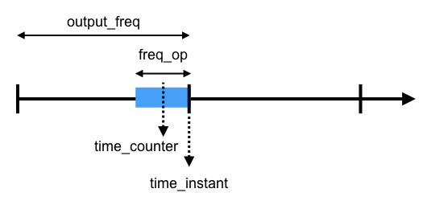
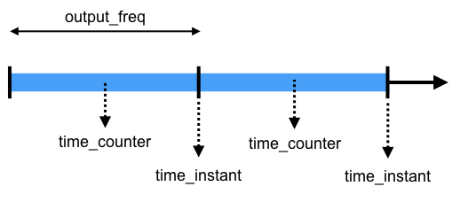

# zonally periodic jet with internal waves configuration

The cpp key is JETN

The type of jet (1 to 4) is defined in `cppdefs.h`

Run time options are found in `croco.in`

## commands from start to finish:

```
./jobcomp
python chain_datarmor.py jet_cfg1_wp75_4km_0a1000j 10 03:00:00 4 jetn 0
# and release
```

Restart:
```
python chain_datarmor.py jet_cfg1_wp75_4km_m1_500a1000j 5 03:00:00 4 jetn 1
# follow instructions and release
```

## outputs:

see [`iodef.xml`](iodef.xml)

### file_his_*.nc

Relevant temporal variable: `time_counter`

Variables are 2D or 3D:

- `v_a` : temporal averaged of variable $v$

- `v_t_cos` : temporal averaged of $v\times\cos(\omega t)$

- `v_t_sin` : temporal averaged of $v\times\cos(\omega t)$

- `v_t_dirac` : instantaneous value of $v$ at the center of the interval

The relevant time interval for this output has size `freq_op` (2d typically) and is outputed every `output_freq` (25d typically).




### file_ave_*.nc

Relevant temporal variable: `time_counter`

Variables are 2D and averaged over a temporal window of size `output_freq` (2d typically).

- `v` : temporal averaged of variable $v$

- `v_t_cos` : temporal averaged of $v\times\cos(\omega t)$

- `v_t_sin` : temporal averaged of $v\times\cos(\omega t)$



### file_surf_*.nc

Relevant temporal variable: `time_instant`

Variables are 2D (surface) and instantaneous every `output_freq` (10 min typically).

### file_inst_*.nc, file_sta1_*.nc, ...

Relevant temporal variable: `time_instant`

Variables are 1D and instantaneous every `output_freq` (30min typically).

### file_swath_*.nc

Not that useful for now.


### nicer treatment of time coordinate

Work is ongoing around xarray in order to implement useful features for this
such as selection alon non-dim coordinates [issue](https://github.com/pydata/xarray/issues/1603)
